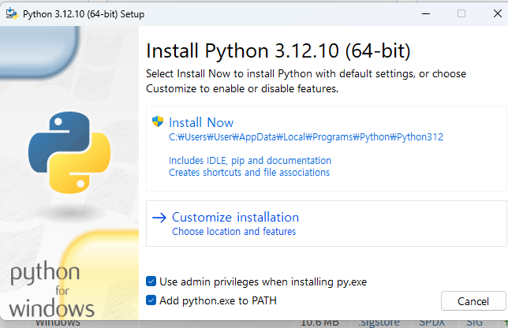
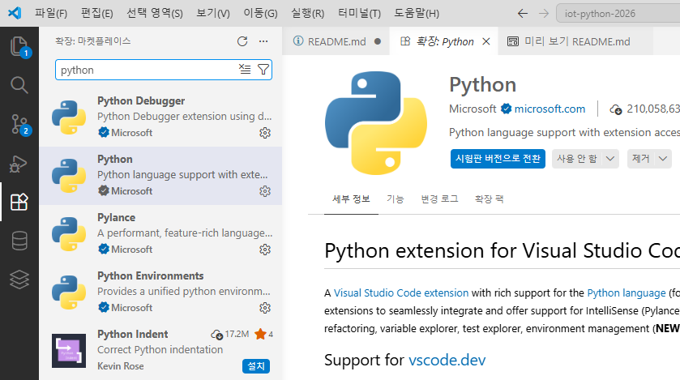

# iot-python-2026
IoT 개발자 파이썬 리포지토리

## 1일차

### 사전 정리

C/C++ 학습완료. 프로그래밍 문법 파악 중

기본문법
- 변수, 데이터형
- 연산자
- 제어문
    -조건문
    -반복문
-함수/메서드
-배열 개념
-포인터/참조 개념
-구조체
-객체지향 클래스
-파일 입출력
-예외처리

다른 언어는 새로 다시 공부해야 한다보다, 필요한 것만 보충 학습하겠다고 생각할 것

### 이론적 개념 정리

#### 파이썬에 신경 안써도 되는 것
- 학습 난이도를 낮추는 목록
    - 자료형 선언 안함
    - 세미콜론 없음(옵션으로 사용 가능)
    - 중괄호 없음 
    - 들여쓰기를 신중히 해야됨
    - `int main()` 강제 아님 - 비슷한 기능은 있음
    - 메모리 할당/해제 거의 안함
    - 헤더 파일 개념 없음
    - 컴파일 과정 신경 거의 안씀
    - 개발환경 설정 어렵지 않다

- 문법 비교표

    |이론개념|C/C++|
    |---|---|---|
    |출력|printf(),cout|print()|
    |변수 선언|int a = 10;|+a=10|
    |조건문|if(a>b){...};|if a>b|
    |반복문+for(int i=0;i<10;i++){}|fori in range(10): |
    |함수 |int add(inta,intb) {}|def add(a,b):|
    |배열 | int arr[5]|list|
    |문자/문자열|char,char[],char*,string |str|

-장점
    -들여쓰기가 코드 불록, {}불필요
    -선언이 없음
    -리스트가 배열보다 훨씬 편하고 간결하다
    -문자열 처리 간단
    -함수 만들기 간단
### 파이썬 설치
-https://python.org
    -최신버전 설치 지양. 3.12 버전
    - 3.12 페이지 검색, Windows installer (64bit) 클릭
    
    -설치
    -아래와 같이 설치
    -다음에서 Documentation aks cpzm gowp
    -Advandced Option dptj 3.12활성화
    -설치 후
    
    -윈도우 디렉토리 path 길이 260자 제한되어 있음. Linux/Mac0S 등과 호환시 문제 발생
    -콘솔에서 확인 안되면 시스템 속성(sysdm.cpl)에서 path 확인할것
    

### VS Code 확장
-확장
    -Python으로 검색 후 설치
    
    Jupyter검색 후 설치

### 파이썬 기본 학습
1.기본 입출력
    -.py 파일 작성
    -Ctrl _F5 실행
    -디버거 선택> Python Debugger 선택
2.리스트(배열 대체)
    - append~sort 까지 11개 함수만 학습
3.제어문
