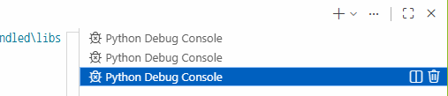
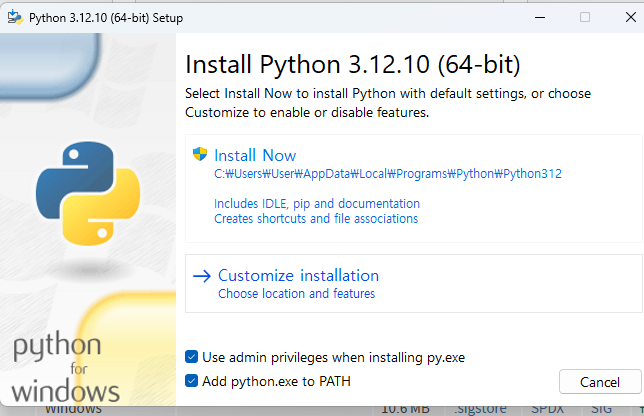
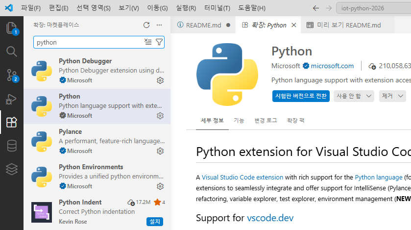
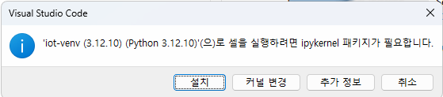

# iot-python-2026
IoT 개발자 파이썬 리포지토리


## 1일차

### 사전 정리

C/C++ 학습완료. 프로그래밍 문법 파악 중

기본문법
- 변수, 데이터형
- 연산자
- 제어문
    -조건문
    -반복문
-함수/메서드
-배열 개념
-포인터/참조 개념
-구조체
-객체지향 클래스
-파일 입출력
-예외처리


다른 언어는 새로 다시 공부해야 한다보다, 필요한 것만 보충 학습하겠다고 생각할 것

### 이론적 개념 정리

#### 파이썬에 신경 안써도 되는 것
- 학습 난이도를 낮추는 목록
    - 자료형 선언 안함
    - 세미콜론 없음(옵션으로 사용 가능)
    - 중괄호 없음 
    - 들여쓰기를 신중히 해야됨
    - `int main()` 강제 아님 - 비슷한 기능은 있음
    - 메모리 할당/해제 거의 안함
    - 헤더 파일 개념 없음
    - 컴파일 과정 신경 거의 안씀
    - 개발환경 설정 어렵지 않다

- 문법 비교표

    |이론개념|C/C++|
    |---|---|---|
    |출력|printf(),cout|print()|
    |변수 선언|int a = 10;|+a=10|
    |조건문|if(a>b){...};|if a>b|
    |반복문+for(int i=0;i<10;i++){}|fori in range(10): |
    |함수 |int add(inta,intb) {}|def add(a,b):|
    |배열 | int arr[5]|list|
    |문자/문자열|char,char[],char*,string |str|

-장점
    -들여쓰기가 코드 불록, {}불필요
    -선언이 없음
    -리스트가 배열보다 훨씬 편하고 간결하다
    -문자열 처리 간단
    -함수 만들기 간단
    -디버그 콘솔이 여러개 실행 가능




### 파이썬 설치
-https://python.org
    -최신버전 설치 지양. 3.12 버전
    - 3.12 페이지 검색, Windows installer (64bit) 클릭
    
    -설치
    -아래와 같이 설치
    -다음에서 Documentation aks cpzm gowp
    -Advandced Option dptj 3.12활성화
    -설치 후
    
    -윈도우 디렉토리 path 길이 260자 제한되어 있음. Linux/Mac0S 등과 호환시 문제 발생
    -콘솔에서 확인 안되면 시스템 속성(sysdm.cpl)에서 path 확인할것
    

### VS Code 확장
-확장
    -Python으로 검색 후 설치
    
    Jupyter검색 후 설치

### 파이썬 기본 학습
1.기본 입출력
    -.py 파일 작성
    -Ctrl _F5 실행
    -디버거 선택> Python Debugger 선택
2.리스트(배열 대체)
    - append~sort 까지 11개 함수만 학습
3.제어문

### 깃허브 확장
- 웹 코딩 환경
   -https://github.com-> com 을 dev로 변경 실행
   -Visual Studio code와 동일한 화면으로 변경
   -주피터

## 2일차

### 파이썬 기본 학습

4.변수,자료형
   - 선언이 없고 자료형을 지정안함
   - 자료형 자체를 사용안함, 형변환 필요
   -기본자료형,int,float,str,bool,NoneType(NULL과 거의 똑같은 기능)
5.연산자

6.문자열
   -c방식 문자열 처리 가능
7.함수
   -객체지향언어 함수 -> 메서드로 호칭
   -파이썬은 함수로 호칭
   -c와 유사하게 함수 사용 전에 선언
   -def로 선언 파라미터 괄호 뒤 : 사용
8.파일 입출력
   -c/c++과 모드가 동일 r,w,a
   -with 구문으로 close() 생략가능
   -각 문장마다 쓰기할대 각문장 끝에 역슬레쉬 엔 붙여야도힘
   -엑셀, csv등 읽기에 많이 사용
9.여기까지 배우고 활용하는 분야도 존재
-데이터분석,머신러닝/딥러닝,...
10.라이브러리 지속사용
    -타언어의 경우 웹검색, 다운로드,개발위치 설치나 복사
    -cpu아키텍처에 따라 32bit 64bit 마다 설치방법이 상이
    -파이썬은 자신만의 패키지 관리자(package Manager) 사용
    -웹 검색 후 pip 명령어로 각 파이썬 개발환경에 맞춰서 설치
    -패키지 > 라이브러리> 모듈
    ```bash
    pip install requests
    ```
10.객체지향
11.예외처리

### 파일 입출력
-인코딩
   -EUC-KR : 2바이트 한글 완성형 인코딩 CP949 동일한 의미
   -UTF-8:1바이트 영문
   - 대한민국 데이터 포털 제공하는 CSV는 EUC-KR사용중 UTF-8변환필요

- CSV
   -엑셀과 호환가능한 텍스트파일

- JSON
   -JavaScript Object Notation: 자바스크립트에서 데이터를 사용하기 위해 만든
   표기방법
   -딕셔너리를 텍스트화
   -데이터를 네트워크로 전달할때 가장 효율적인 파일형식
   -XML을 대체하는 기술

   > pip list
   Package Version
   ----- -----
   numpy   2.4.4
   pip     25.0.1
12, 기타 자료구조
    -리스트 외 튜플, 딕셔너리, 셋 등 ...
    -각 자료구조 형태를 구분[소스](./day03/ex13_datastruct.py)

13.main
    -파이썬은 main 함수가 필요없음[소스](./day03/ex14_main.py)
    -여러 파일중 시작점(entry point)을 지칭할 때는 사용
    - `__name__` 특수변수를 사용
14. 가상환경(Virtual Enviromanet)
    -프로젝트 마다 파있너 환경을 따로 사용하기 위해 만들어진 개념
    -프로젝트 생성 시 독립된 파이썬, 라이브러리 쎄트 새로 생성
    -실제환경 C:\Program Files\Python312와 비교
    -일반적으로 프로젝트 폴더에서 생성
    ```bash
    >python -m venv iot-venv 가상환경이름
    ```

    - 가상환경 생성 후 가상환경 활성화해야됨

    
    - 가상환경은 github에 올리지 말것

    -가산황경은 github에 올리지 말것. . gitignore에 가상환경 폴더명 추가할 것
15.객체지향[소스1](./day03/ex15_oop.py) ~[소스2](./day03/ex18_encapsule.py)
    -c++의 객체지향, 클래스와 동일
    -접근제한자가 없음(public,privated,protected)
    -c++ 과 달리 new사용 x 변수등 제약사항에 문제 없음
    -클래스 내의 모든 함수의 파라미터는 `self`로 시작, c++의 this와 동일
    -호출시에는 self를 사용x
    -파이썬 철학 : `막지 말고, 알아서 지켜라`

16.예외처리 - [소스](./day03/ex20_jupyter_start.ipynb)
-비정상 종료를 막는 기능
-try ~except 로 구분지어 사용
except는 여러번 쓸수있으니 하나로 통이해도 무방
-예외처리가 발생하면 처리속도가 늦어짐, 비정상종료를 막기위한 부분

### 파일 입출력


### 주피터노트북
-주피터 노트부
-파이썬을 좀 더 인터랙티브하게 상용하고자 하는 취지
-논문처럼 글과 소스 실행을 병행
-PROJECT JUPYTER
-확장에서 Jupyter 설치

-사용법
    -명령 팔레트(Ctrl+Shift+P)
    
    -Untitled-1.ipynb 파일 생성, 파일 저장 우선
    -커널 선택 클릭
    -마크다운셸(일반적 설명글), 코드셸(소스코드 작성)로 구분

-주피터 노트북 단축키
    -a : 현재 셸 위에 코드셸 추가
    -b : 현재 셸 아래에 코드셸이 추가됨
    -enter : 현재 셸 편집모드로 진입(커서 깜빡임 확인)
    -Ctrl +enter : 마크다운셸은 빠져나오기 , 코드셸을 실행
    -최초 한번만 팝업
    
    -l:셸 선택모드에서 시작하면 라인 번호 표시 토글

-사용처
    -웹상에서 동작하므로 많은 서비스를 지우너
    -[Github Codespace](https://github.com/features/codespaces) - 기존 리포지토리와 연결 지원(무료인경우 한달 140시간)
    -github codespace - 기존 리포지토리와 연결 지원
    -[]

### 데이터 분석 기초
-분석용 기초 이론
    -리스트,튜플,딕셔너리
    -리스트 컴프리헨션
    -파일 입출력
    -Numpy
    -Pandas
    -Matplotlib
    -Seaborn
    -Folium
    -기초 통계
    -데이터 전처리


